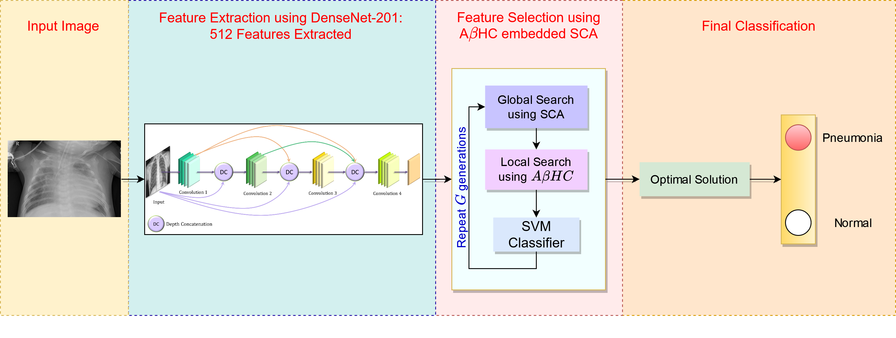

# Pneumonia Detection using Local Search aided Sine-Cosine Algorithm
Based on our paper **"[Pneumonia Detection from Lung X-ray Images using Local Search Aided Sine Cosine Algorithm based Deep Feature Selection Method](https://dx.doi.org/10.1002/int.22703)"** published in **_International Journal of Intelligent Systems_, Wiley (2021).**

_Note_: Access the preprint [here](/preprint/pneumonia_absca.pdf). For the PDF of the published version of the manuscript, please email the first and/or second authors at: [soumitri.chattopadhyay@gmail.com](mailto:soumitri.chattopadhyay@gmail.com) and [rohitkunduju@gmail.com](mailto:rohitkunduju@gmail.com).

## Model Architecture


## Requirements
To install the required dependencies run the following in command prompt:
`pip install -r requirements.txt`

## Running the codes:
Required directory structure:

(Note: ``train`` and ``val`` contains subfolders representing classes in the dataset.)

```

+-- data
|   +-- .
|   +-- train
|   +-- val
+-- AbSCA.py
+-- local_search.py
+-- main.py

```
Then, run the code using the command prompt as follows:

`python main.py --data_directory "data"`

Available arguments:
- `--epochs`: Number of epochs of training. Default = 20
- `--learning_rate`: Learning Rate. Default = 0.001
- `--batch_size`: Batch Size. Default = 4
- `--momentum`: Momentum. Default = 0.9

## Citation:
If this article helps in your research in any way, please cite us using:

```
@article{chattopadhyay2021pneumonia,
  title={Pneumonia Detection from Lung X-ray Images using Local Search Aided Sine Cosine Algorithm based Deep Feature Selection Method},
  author={Chattopadhyay, Soumitri and Kundu, Rohit and Singh, Pawan Kumar and Mirjalili, Seyedali and Sarkar, Ram},
  journal={International Journal of Intelligent Systems},
  publisher={Wiley},
  pages={1--38},
  year={2021},
  DOI={10.1002/int.22703}
}
```
